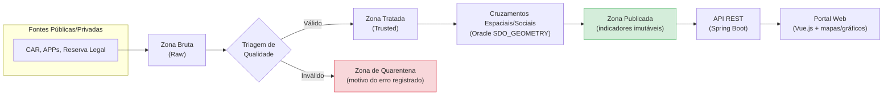

# API 4º Semestre BD - LizardsDBA

## GeoRural DataHub
### Plataforma de dados de imóveis rurais com controle de qualidade e rastreabilidade dos indicadores ambientais

---

## 🎯 Desafio
A **Visiona Tecnologia Espacial** atua em projetos que utilizam informações territoriais, ambientais e geoespaciais para apoiar processos de planejamento e tomada de decisão. Atualmente, os dados sobre imóveis rurais (Cadastro Ambiental Rural - CAR, APPs, Reserva Legal) vêm de fontes diversas, em diferentes formatos, níveis de qualidade e com frequências de atualização variadas, sem uma gestão centralizada.

Essa descentralização gera sérias dificuldades para garantir a **rastreabilidade** e **auditabilidade** completa das análises (saber qual versão estava vigendo, qual arquivo foi usado, quais dados foram validados ou rejeitados na quarentena e quais regras participaram do cálculo do indicador). Isso é crítico, por exemplo, para a concessão de crédito rural ou auditorias ecológicas.

---

## 💡 Solução Proposta
O **GeoRural DataHub** é um MVP baseado em uma arquitetura de dados Medalhão de quatro zonas (Bruta, Tratada, Publicada e Quarentena) projetado para resolver esses gargalos de governança socioambiental.

A plataforma automatiza a ingestão de bases de dados geográficas e tabulares públicas/privadas, executa rotinas automáticas de triagem de qualidade, isola registros inconsistentes para quarentena (registrando detalhadamente os motivos) e processa cruzamentos espaciais e sociais complexos por meio do banco de dados Oracle. Os indicadores resultantes são disponibilizados via APIs REST documentadas e por meio de um portal web interativo dotado de mapas e gráficos de risco. Toda versão publicada é imutável e sua linhagem de dados pode ser auditada de ponta a ponta.

### 🏗️ Arquitetura (Medalhão)



> Cada indicador publicado mantém a linhagem completa até a carga bruta original, permitindo auditoria de ponta a ponta.

---

## 📋 Backlog do Produto e Sprints

### Tabela 1 – Product Backlog Geral
| Rank | Prioridade | User Story (Fórmula Estrita da FATEC SJC) | Estimativa (SP) | Sprint |
| :---: | :---: | :--- | :---: | :---: |
| **1** | Alta | **US01 (Catalogação)**: Como Operador de Ingestão, quero registrar as fontes oficiais de dados ambientais no sistema, para que a equipe saiba a origem confiável e a vigência temporal de cada informação. | 3 | 1 |
| **2** | Alta | **US02 (Importação)**: Como Operador de Ingestão, quero carregar na plataforma os arquivos de limites territoriais das propriedades rurais fornecidos pelos órgãos públicos, para disponibilizar esses dados para as análises socioambientais. | 5 | 1 |
| **3** | Alta | **US03 (Triagem)**: Como Analista Socioambiental, quero que o sistema separe automaticamente dados inválidos ou incompletos enviados pelas fontes públicas, para evitar que erros de preenchimento distorçam as análises de conformidade. | 8 | 1 |
| **4** | Média | **US04 (Quarentena)**: Como Analista Socioambiental, quero visualizar detalhadamente os registros que falharam na triagem automática com o motivo específico de sua reprovação, para diagnosticar inconsistências recorrentes dos órgãos emissores. | 5 | 2 |
| **5** | Alta | **US05 (Análise Espacial)**: Como Analista Socioambiental, quero identificar se o limite geográfico do imóvel rural invade terras protegidas ou desrespeita áreas de preservação permanente e de reserva legal, para apontar passivos ecológicos imediatos. | 8 | 2 |
| **6** | Alta | **US06 (Alerta de Restrições)**: Como Analista Socioambiental, quero cruzar as informações de identificação dos proprietários rurais com a listagem de infrações trabalhistas graves, para gerar alertas de violações aos direitos humanos associadas à propriedade. | 3 | 3 |
| **7** | Média | **US07 (Parecer de Crédito)**: Como Gestor de Crédito, quero visualizar em mapas e gráficos os indicadores ambientais consolidados e as sobreposições territoriais de um imóvel rural, para avaliar com rapidez o risco de conceder financiamentos ao produtor. | 8 | 3 |
| **8** | Média | **US08 (Comparação de Histórico)**: Como Gestor de Crédito, quero comparar os indicadores de um mesmo imóvel entre datas de publicação distintas, para verificar se houve melhora ou piora nas práticas ecológicas do produtor ao longo do tempo. | 5 | 4 |
| **9** | Baixa | **US09 (Linhagem e Auditoria)**: Como Auditor Interno, quero reconstituir visualmente o fluxo histórico de um indicador publicado até a sua carga bruta original, para comprovar a integridade jurídica das análises em fiscalizações ou disputas. | 8 | 4 |

---

## 🛠️ DoR (Definition of Ready)
Para que uma User Story seja considerada pronta para desenvolvimento, ela deve cumprir o checklist acordado:
* [ ] **História Descrita**: A história tem um título claro, descrição no formato padrão da FATEC e seu objetivo de negócio é plenamente compreendido.
* [ ] **Critérios de Aceitação**: Todos os critérios de aceitação foram detalhados e acordados com o time.
* [ ] **Regras de Negócio**: As regras de validação lógica e validações espaciais estão mapeadas e documentadas.
* [ ] **Insumos de Homologação**: Amostras reais de dados das fontes de imóveis rurais (CAR) e tabelas secundárias estão disponíveis.
* [ ] **Modelo de Dados**: O diagrama relacional da camada de dados envolvida está desenhado e homologado pelo DBA.
* [ ] **Estimativa Realizada**: O esforço de desenvolvimento foi estimado e pontuado em Story Points pela equipe.

---

## 🚀 DoD (Definition of Done)
Uma User Story só é considerada finalizada ("Pronta") se atender a todos os critérios de qualidade do 4º Semestre:
* [ ] **Estrutura de Banco (Oracle)**: Tabelas da arquitetura medalhão criadas e implantadas na Oracle Cloud, com índices espaciais, constraints e rotinas PL/SQL testadas.
* [ ] **Backend (Spring Boot)**: APIs REST documentadas no padrão OpenAPI (Swagger) e integradas ao banco.
* [ ] **Frontend (Vue.js)**: Telas responsivas implementadas conforme wireframes, integradas com Axios, Leaflet e Chart.js.
* [ ] **Versionamento & Git**: Branch de funcionalidade (`feature/`) criada e Pull Request (PR) aberto e revisado por outro par.
* [ ] **Qualidade de Código**: Código livre de fragmentos comentados e lixo tecnológico.
* [ ] **Cobertura de Testes**: Testes de unidade com **cobertura mínima de 70%** (requisito acadêmico obrigatório do guia) e testes de pipeline funcionando.
* [ ] **Deploy em Nuvem**: A aplicação está implantada e testada no ambiente em nuvem.

---

## 📅 Cronograma de Sprints
| Sprint | Período | Documentação |
| :---: | :---: | :---: |
| 🔴 **KICK-OFF GERAL** | 02/03 - 06/03 | [ Kick-off Geral ] |
| 🔴 **CONSTRUÇÃO DO BACKLOG / PLANNING** | 09/03 - 13/03 | [ Planejamento ] |
| 🔴 **SPRINT 1** | 16/03 - 05/04 | [Sprint 1](./docs/processo/sprints/sprint-1/README.md) |
| 🔴 **SPRINT 1 REVIEW/PLANNING** | 06/04 - 10/04 | [Sprint 1](./docs/processo/sprints/sprint-1/README.md) |
| 🔴 **SPRINT 2** | 13/04 - 03/05 | [Sprint 2](./docs/processo/sprints/sprint-2/README.md) |
| 🔴 **SPRINT 2 REVIEW/PLANNING** | 04/05 - 08/05 | [Sprint 2](./docs/processo/sprints/sprint-2/README.md) |
| 🔴 **SPRINT 3** | 11/05 - 31/05 | [Sprint 3](./docs/processo/sprints/sprint-3/README.md) |
| 🔴 **SPRINT 3 REVIEW/PLANNING** | 01/06 - 05/06 | [Sprint 3](./docs/processo/sprints/sprint-3/README.md) |
| 🔴 **SPRINT 4** | 08/06 - 28/06 | [Sprint 4](./docs/processo/sprints/sprint-4/README.md) |
| 🔴 **SPRINT 4 REVIEW/PLANNING (ENTREGA FINAL)** | 29/06 - 03/07 | [Sprint 4](./docs/processo/sprints/sprint-4/README.md) |

---

## 📽️ Vídeo de Apresentação
*   **Link**: _a ser adicionado ao final da Sprint 4_

---

## ⚙️ Como Rodar o Projeto

### Pré-requisitos
*   [JDK 17+](https://adoptium.net/)
*   [Maven](https://maven.apache.org/) ou Gradle
*   [Node.js 18+](https://nodejs.org/) e npm
*   Acesso a uma instância Oracle Database (local via Docker ou Oracle Cloud)
*   Git

### Backend (Spring Boot)
```bash
cd backend
cp .env.example .env        # configure as credenciais do Oracle
./mvnw clean install
./mvnw spring-boot:run
```
A API sobe por padrão em `http://localhost:8080` e a documentação Swagger em `http://localhost:8080/swagger-ui.html`.

### Frontend (Vue.js)
```bash
cd frontend
npm install
npm run dev
```
A aplicação sobe por padrão em `http://localhost:5173`.

### Banco de Dados (Oracle)
1.  Execute os scripts de criação de schema em `docs/database/scripts/` (zonas Bruta, Tratada, Publicada e Quarentena).
2.  Configure a string de conexão no `.env` do backend (`DB_URL`, `DB_USER`, `DB_PASSWORD`).
3.  Rotinas PL/SQL de triagem/quarentena ficam em `docs/database/plsql/`.

> ⚠️ Ajuste os caminhos e comandos acima conforme a estrutura real de pastas do repositório.

---

## 🛠️ Tecnologias Utilizadas
*   **Backend**: Java, Spring Boot, Spring Security (Controle de Acesso), Spring Data JPA e Hibernate
*   **Banco de Dados**: Oracle Database Relacional, Oracle PL/SQL, recursos GIS (SDO_GEOMETRY) e Oracle Cloud
*   **Frontend**: Vue.js, Axios, Leaflet (Mapas Interativos) e Chart.js/Vue Chart.js (Gráficos)
*   **Orquestração & Pipelines**: Apache Airflow
*   **Controle de Versão**: Git e GitHub
*   **Documentação**: OpenAPI / Swagger (Rotas de API) e Markdown

---

## 📖 Manuais
*   [Manual do Usuário e Técnico](docs/manuais/)

---

## 👥 Equipe
*   **Product Owner**: [Nome do Aluno]
*   **Scrum Master**: [Nome do Aluno]
*   **Dev Team (Frontend)**: [Nome do Aluno]
*   **Dev Team (Backend)**: [Nome do Aluno]
*   **Dev Team (Banco de Dados / DBA)**: [Nome do Aluno]

---

## ⚠️ Requisitos de Permanência
*   **Reuniões Fixas**: Participar dos alinhamentos definidos pelo grupo. Avisar com antecedência caso ocorra algum imprevisto técnico ou pessoal.
*   **Ferramenta de Gestão (Jira)**: Manter sempre o backlog de tarefas atualizado, com as respectivas atividades em andamento e encerradas.
*   **Comunicação**: Manter diálogo ativo e transparente no WhatsApp e no Slack institucional.
*   **Prazos**: Respeitar e atentar-se aos prazos de entregas de cada Sprint.
*   **Responsabilidade Individual**: Comprometer-se ativamente com o desenvolvimento, documentação e testes das tarefas atribuídas.
